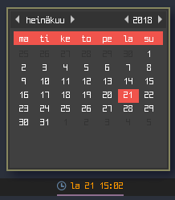
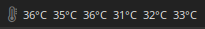

# Script: info-notification-github

A small script that shows your GitHub notifications.


## Dependencies

* `curl`
* `jq`


## Configuration

Generate a token at `GitHub Settings` > `Developer settings` > `Personal access tokens`.


## Module

```ini
[module/notification-github]
type = custom/script
exec = ~/polybar-scripts/info-notification-github.sh
interval = 60
```

# Script: info-redshift-temp

This script displays the current color temperature.


## Module

```ini
[module/info-redshift-temp]
type = custom/script
exec = ~/polybar-scripts/info-redshift-temp.sh
interval = 5
```

# Script: info-trash

This script count the files in you trash directory.


## Module

```ini
[module/info-trash]
type = custom/script
exec = ~/polybar-scripts/info-trash.sh
interval = 60
click-left = ~/polybar-scripts/info-trash.sh --clean
```

# Script: isactive-bluetooth

A script that shows if bluetooth is on or off.


## Module

```ini
[module/isactive-bluetooth]
type = custom/script
exec = ~/polybar-scripts/isactive-bluetooth.sh
interval = 10
```

# Script: popup-calendar

A small script that displays the date and opens a small popup calendar with YAD when clicked.




## Dependencies

* [`yad`](https://sourceforge.net/projects/yad-dialog/)
* `xdotool`


## Configuration

Change these values if you want:

```sh
YAD_WIDTH=200
YAD_HEIGHT=200
BOTTOM=false
DATE="$(date +"%a %d %H:%M")"
```

If you use a tiling window manager you should enable floating for `yad`. This example is for `i3wm`:

```ini
for_window [class="Yad"] floating enable
```


## Module

```ini
[module/popup-calendar]
type = custom/script
exec = ~/polybar-scripts/popup-calendar.sh
interval = 5
click-left = ~/polybar-scripts/popup-calendar.sh --popup
```

# Script: system-cpu-temppercore

A script that displays the temperature for each core.




## Dependencies

* `lm_sensors`


## Module

```ini
[module/system-cpu-temppercore]
type = custom/script
exec = ~/polybar-scripts/system-cpu-temppercore.sh
interval = 60
```

# Script: system-fan-speed

A shell script which displays the fan speed.


## Dependencies

* `lm_sensors`
* `bc`


## Module

```ini
[module/system-fan-speed]
type = custom/script
exec = ~/polybar-scripts/system-fan-speed.sh
interval = 10
```

# Script: system-uptime-pretty

A shell script which displays the output of `uptime --pretty` in a minimal fashion:

`2d 1h 35m`


## Module

```ini
[module/system-uptime-pretty]
type = custom/script
exec = ~/polybar-scripts/system-uptime-pretty.sh
interval = 30
```

# Script: system-usb-mount

A small script that shows your mounted and not mounted removable devices.

Click left to mount all removable devices. Click right to unmount the devices. The removable devices are then turned off with `udisksctl power-off`.

The mount option has a feature: You can also start a file manager and open the device when you mount it. Look at the example in the code: `terminal -e "bash -lc 'filemanager $mountpoint'" &`


## Dependencies

* `jq`
* `udisks2`


## Module

```ini
[module/system-usb-mount]
type = custom/script
exec = ~/polybar-scripts/system-usb-mount.sh
interval = 5
click-left = ~/polybar-scripts/system-usb-mount.sh --mount
click-right = ~/polybar-scripts/system-usb-mount.sh --unmount
```

# Script: system-usb-udev

A small script that shows your mounted and not mounted removable devices. This is an extended version of [system-usb-mount](../system-usb-mount).

Click left to mount all removable devices. Click right to unmount the devices. The removable devices are then turned off with `udisksctl power-off`.

The mount option has a feature: You can also start a file manager and open the device when you mount it. Look at the example in the code: `terminal -e "bash -lc 'filemanager $mountpoint'" &`

This script is able to display device changes in real time. For this udev is being used.


## Dependencies

* `jq`
* `udisks2`


## Configuration

Copy `95-usb.rules` to `/etc/udev/rules.d/95-usb.rules`. Make sure that the paths in the file have been modified properly.

Also change the file path in line `#45`.


## Module

```ini
[module/system-usb-udev]
type = custom/script
exec = ~/polybar-scripts/system-usb-udev.sh
tail = true
click-left = ~/polybar-scripts/system-usb-udev.sh --mount
click-right = ~/polybar-scripts/system-usb-udev.sh --unmount
```

# Script: updates-arch-combined

A script that shows if there are updates for Arch Linux and AUR updates.

See also [updates-arch](../updates-arch) and [updates-arch-aur](../updates-arch-aur).


## Dependencies

* `pacman-contrib`

The possibilities depend on your AUR helper. Not all helpers can report the pending updates.

At the moment `trizen` and `cower` are documented. Take a look at the script to see how it works.


## Module

```ini
[module/updates-arch-combined]
type = custom/script
exec = ~/polybar-scripts/updates-arch-combined.sh
interval = 600
```

