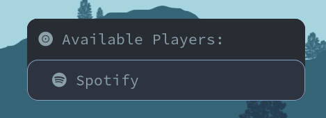

# Rofi Media Player Controller

This is a small script that can be run from the command line or ideally with a keyboard
shortcut that will do two things:

1. If there is no media player detected, will ask the user to chose a player
2. Once a player is detected, the user can play/pause, skip, and rewind

# Screenshots
Picking a Media Player

Using Controls

