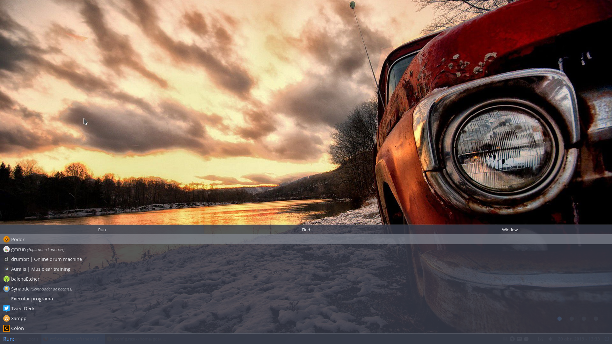
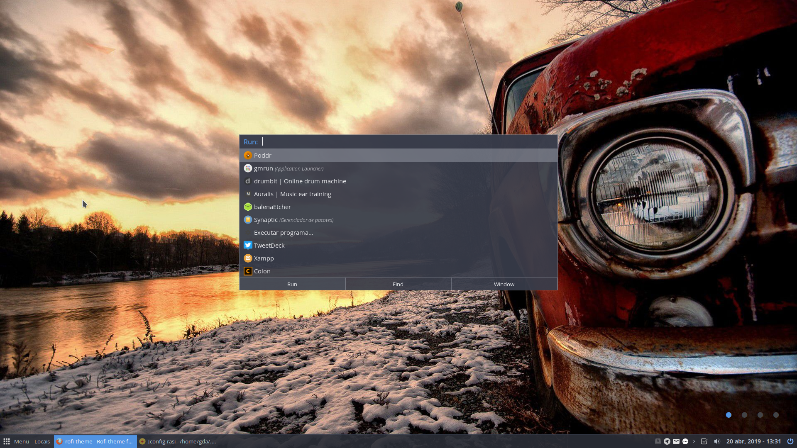
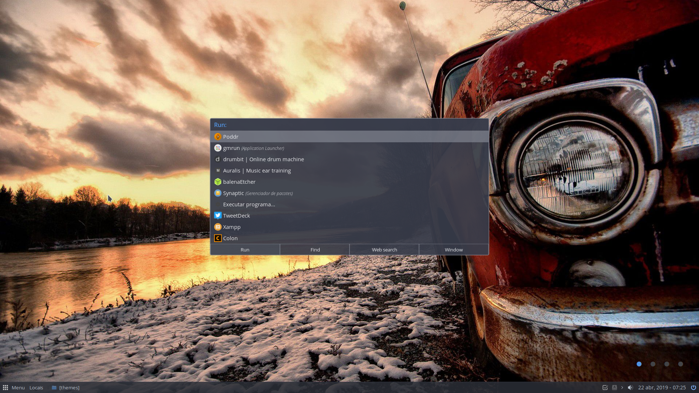
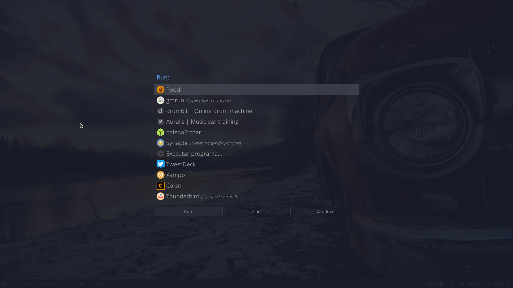
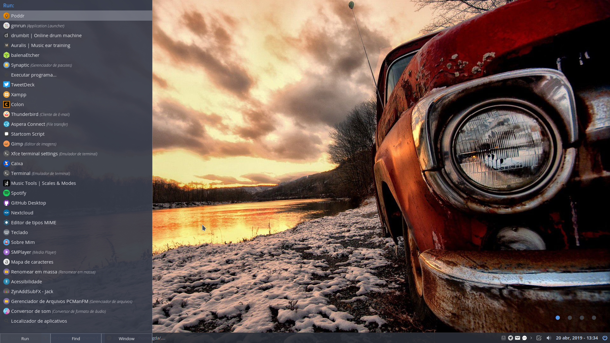
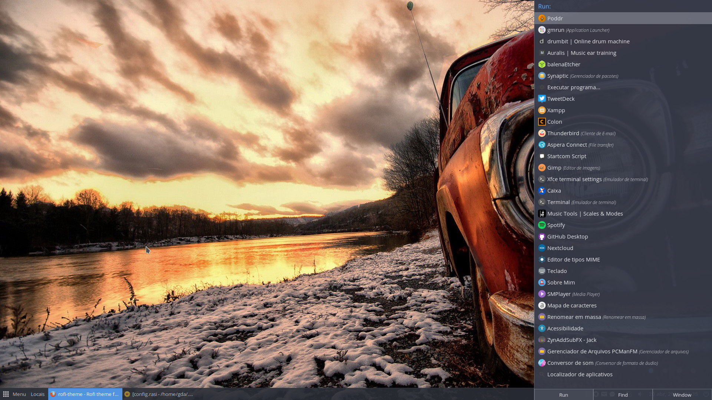
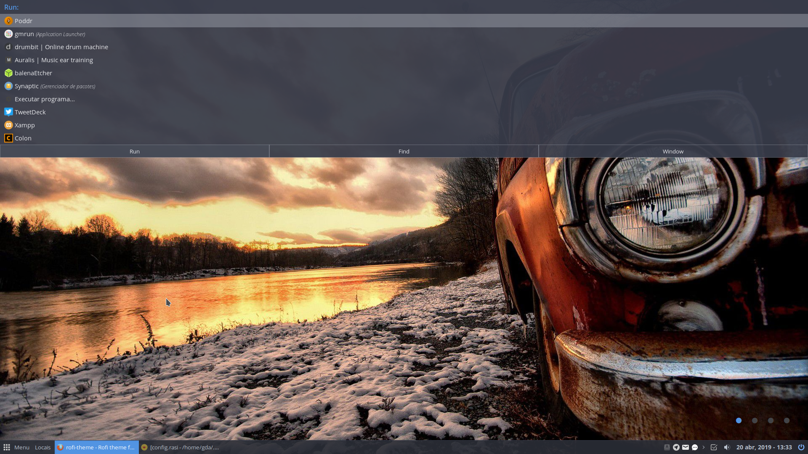

# Install

Just save all .rasi files at `~/.config/rofi/themes/` and edit your `~/.config/rofi/config.rasi` file, like this:

```
@import "/home/yourusername/.config/rofi/themes/debxp-arc-dark-fullscreen.rasi"
```

## Screenshots

**debxp-arc-dark-bottom.rasi**



---

**debxp-arc-dark-center.rasi**



---

**debxp-arc-dark-center-rounded.rasi**



---

**debxp-arc-dark-fullscreen.rasi**



---

**debxp-arc-dark-left.rasi**



---

**debxp-arc-dark-right.rasi**



---

**debxp-arc-dark-top.rasi**



---

## Important!

Please, before use these themes, find and edit the lines below to fit your system fonts and icon theme:

```
drun-icon-theme: "Numix-Circle";

font-generic: "Open Sans 11";
font-button:  "Open Sans 10";
font-prompt:  "Open Sans Semibold 12";

```